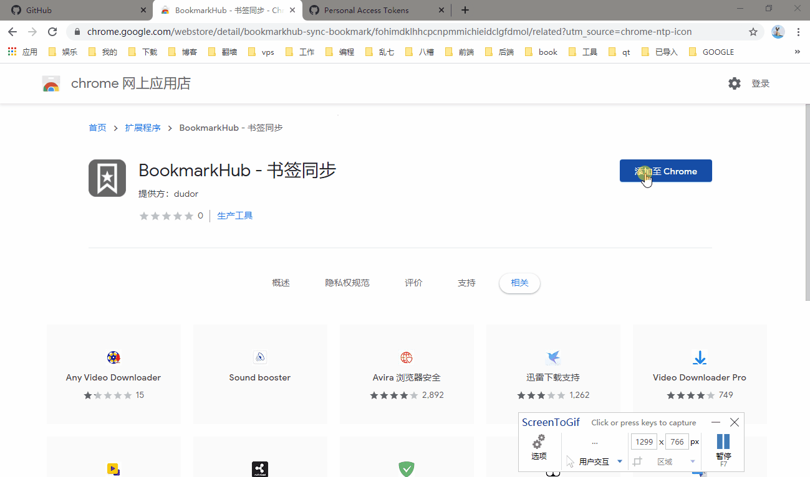
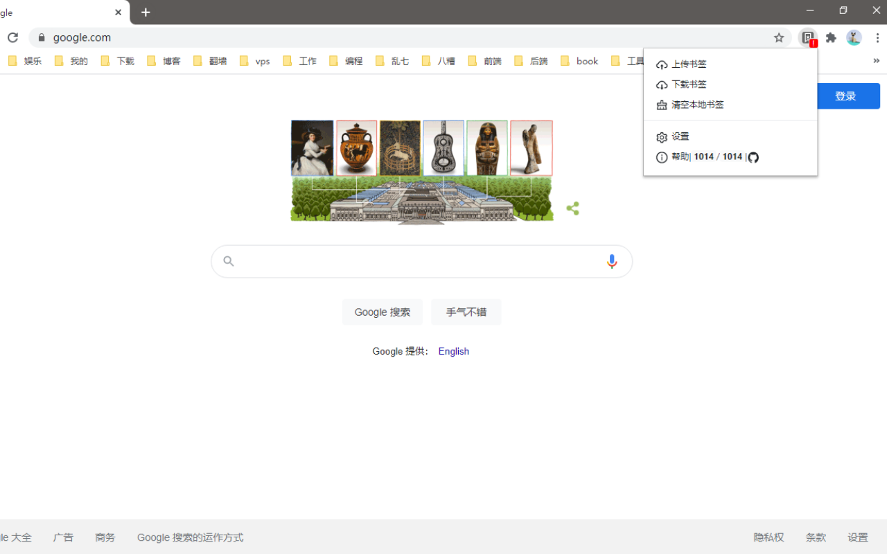
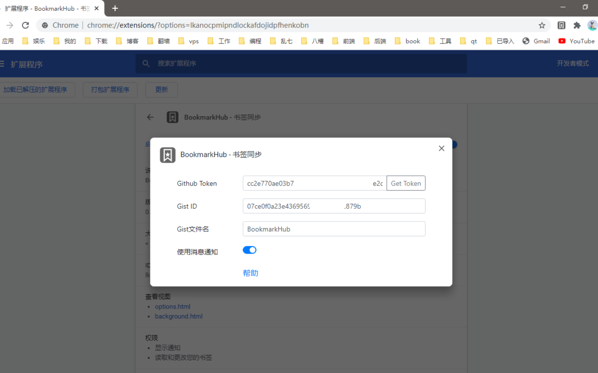

<!-- PROJECT LOGO -->
 

  

  <h1 align="center">BookmarkHub</h1>
  

    BookmarkHub is a browser plug-in that can synchronize your bookmarks between different browsers.
     
    <a href="https://github.com/dudor/BookmarkHub/issues">Feedback</a>
    ·
    <a href="/README_cn.md">简体中文</a>
    ·
    <a href="/README.md">English</a>
  

<!-- TABLE OF CONTENTS -->

  
<h2 style="display: inline-block">Table of Contents</h2>

  <ol>
    <li><a href="#about-the-project">About The Project</a></li>
    <li><a href="#features">Features</a></li>
    <li><a href="#installation">Installation</a></li>
    <li><a href="#usage">Usage</a></li>
    <li><a href="#roadmap">Roadmap</a></li>
    <li><a href="#license">License</a></li>
    <li><a href="#contact">Contact</a></li>
  </ol>

<!-- ABOUT THE PROJECT -->
## About The Project 

BookmarkHub is a browser plug-in that can synchronize your bookmarks between different browsers.

For major browsers such as Chrome, Firefox, Microsoft Edge, and more.

It uses GitHub's Gist records to store browser bookmarks for safe and secure use.

## Features
* No registration required, just use the Token and Gist of your GitHub account
* Easy to upload and download bookmarks with one click
* Clear all local bookmarks with one click
* Support cross-machine and cross-browser synchronization of bookmarks
* Support to display the number of local and remote bookmarks

## Installation
> This plug-in requires bookmarks to be stored in Gist, so make sure you have a GitHub account or register your GitHub account over the network.
* [Chrome](https://chrome.google.com/webstore/detail/bookmarkhub-sync-bookmark/fohimdklhhcpcnpmmichieidclgfdmol)
* [Firefox](https://addons.mozilla.org/en/firefox/addon/BookmarkHub/)
* [Microsoft Edge](https://microsoftedge.microsoft.com/addons/detail/BookmarkHub/fdnmfpogadcljhecfhdikdecbkggfmgk)
* [Other browsers based on the Chromium kernel](https://chrome.google.com/webstore/detail/bookmarkhub-sync-bookmark/fohimdklhhcpcnpmmichieidclgfdmol)

<!-- USAGE EXAMPLES -->
## Usage

1. [Login](https://github.com/login) GitHub，If you don't have an account, please [click here to register](https://github.com/join)。
2. [Create a token that manages the gist](https://github.com/settings/tokens/new)。
3. [Create a secret gist](https://gist.github.com)。__Note: If it's a public gist, your bookmarks can be searched by others。__
4. Download BookmarkHub in the browser store, click the plug-in's settings button, fill in the token and gist ID in the pop-up settings window, and you can upload the download bookmark。

<!-- ROADMAP -->
## Roadmap

- [ ] Automatically sync bookmarks
- [ ] Support webdav protocol
- [ ] Mobile app
- [ ] Import and Export
- [ ] Share bookmarks

<!-- LICENSE -->
## License

See `LICENSE` for more information.

<!-- CONTACT -->
## Contact

dudor

Project Link: [https://github.com/dudor/BookmarkHub](https://github.com/dudor/BookmarkHub)

